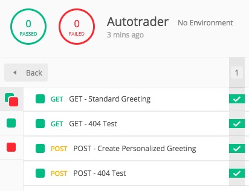
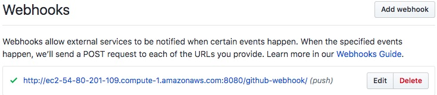

# Greetings Micro Service Repository

This repository contains the Greetings micro service.

## Requests

The following HTTP requests are covered:

- GET /greetings/hello - respond with `Hello World!` greeting

- GET /greetings/hello/{name} with `name` as a path variable - respond with `Hello ${name} World!` greeting

- POST /greetings/hello with `name` in the body of the request - respond with `Hello ${name} World!` greeting, if the greetings has NOT yet been created; respond with `Hello ${name} World!  Your name was previously saved.` otherwise.

- GET/POST /greetings/* - respond with a message related to `Status 404 ...`

## Technology

- Java 1.8
- Spring Boot
- Maven - to build only
- Tomcat - Dockerized
- AWS Elastic Beanstalk - buildspec.yml - `ignore for now`

## Build Commands

The following commands build a WAR file to be deployed to a dockerized Tomcat.

### WAR File

```sh
mvn clean prepare-package war:war
```

### Docker Container

```sh
docker build -t autotrader:latest Dockerfile .
```

## Integration Tests

## Location

>src/test/postman/  
|-- Autotrader.postman_test_run_2019-11-22.json  
|-- Autotrader.postman_tests_2019-11-21.json  
|-- test_results_screenshot_2019-11-22.jpg  

[Postman](https://www.getpostman.com/) is the tool of choice. You can import the test suite from the following file:

- `/greetings-microservice-repo/src/test/posman/Autotrader.postman_tests_2019-11-21.json`

## Sample Test Run

Here is a screenshot from sample run of this test suite (the JSON is also available alongside the test suite mentioned above):



## GitHub Automation

_GitHub Webhook_  

Testing GitHub and Jenkins integration
Line 2
Line 3
Multi-branch scan trigger 1
Multi-branch scan trigger 2
Multi-branch scan trigger 3
Multi-branch scan trigger 4